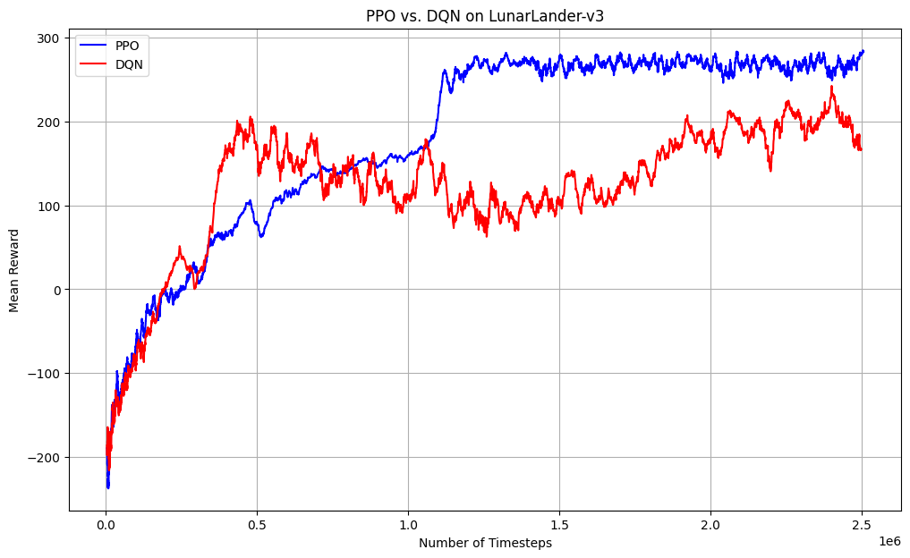
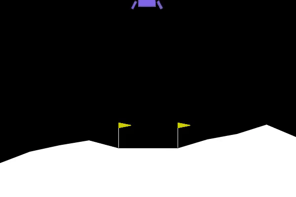
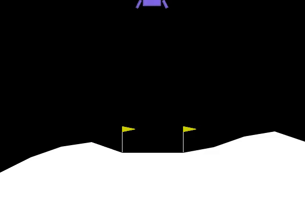

# Comparing PPO and DQN on LunarLander-v3

This project trains and evaluates two reinforcement learning agents, using Proximal Policy Optimization (PPO) and Deep Q-Networks (DQN), to solve the LunarLander-v3 environment from Gymnasium. The goal is to successfully land a lunar module between two flags.

## Table of Contents
- [Techniques Used](#techniques-used)
- [Results](#results)
  - [Learning Curve](#learning-curve)
  - [Agent Performance](#agent-performance)
- [How to Run](#how-to-run)
- [File Structure](#file-structure)


## Techniques Used

This project leverages several key concepts and libraries in reinforcement learning:

*   **Algorithms:**
    *   **Proximal Policy Optimization (PPO):** An on-policy algorithm known for its stability and reliable performance. It learns a policy and a value function and uses a clipped objective to prevent destructively large policy updates.
    *   **Deep Q-Network (DQN):** An off-policy algorithm that learns a Q-value for each action in a given state. This implementation uses a replay buffer to decorrelate experiences and a target network for stable learning.
*   **Frameworks:**
    *   **Stable Baselines3:** A set of reliable implementations of reinforcement learning algorithms in PyTorch.
    *   **Gymnasium:** A standard toolkit for developing and comparing reinforcement learning algorithms, providing the `LunarLander-v3` environment.
*   **Best Practices:**
    *   **`EvalCallback`:** A callback is used during training to periodically evaluate the agent on a separate, deterministic environment. This ensures that the model with the highest average reward is saved, preventing overfitting and capturing the agent at its peak performance.
    *   **Hyperparameter Tuning:** The models use tuned hyperparameters to improve sample efficiency and achieve higher final rewards.
    *   **Vectorized Environments:** The training process uses `make_vec_env` to run multiple environments in parallel, significantly speeding up data collection.


## Results

### Learning Curve

The plot below compares the performance of PPO and DQN over 1,000,000 training timesteps. The reward is smoothed over a window of 50 episodes to show the learning trend.

PPO demonstrates faster initial learning and converges to a slightly higher and more stable reward compared to DQN in this experiment.




### Agent Performance

The final saved models represent the agents at their peak performance during the training run.

#### PPO Agent in Action
The PPO agent learns a smooth and efficient landing strategy.



#### DQN Agent in Action
The DQN agent also successfully learns to land, sometimes exhibiting different behaviors due to the nature of its Q-learning algorithm.




## How to Run

To replicate these results, follow these steps.

1.  **Clone the repository:**
    ```bash
    git clone https://github.com/YOUR_USERNAME/lunar-lander-rl.git
    cd lunar-lander-rl
    ```

2.  **Create a virtual environment:**
    ```bash
    python -m venv venv
    source venv/bin/activate  # On Windows, use `venv\Scripts\activate`
    ```

3.  **Install dependencies:**
    ```bash
    pip install -r requirements.txt
    ```

4.  **Run the training script:**
    *Note: Training will take a significant amount of time and is CPU/GPU intensive.*
    ```bash
    python lunar_lander_rl.py
    ```

5.  **View the outputs:**
    The script will generate new `logs/` and `videos/` directories and display the final learning curve plot.


## File Structure

```
.
├── .gitignore
├── README.md
├── requirements.txt
├── lunar_lander_rl.py
└── results/
    ├── plots/
    │   └── learning_curve.png
    └── videos/
        ├── ppo_demo.gif
        └── dqn_demo.gif
```
